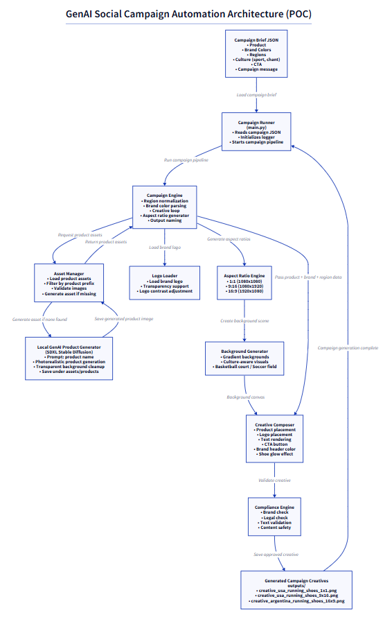

```markdown
# GenAI Social Campaign Automation (POC)

This project demonstrates a **Generative AI powered system to automatically generate social media advertising creatives** based on a campaign brief.  

The system automates:

• Campaign creative generation  
• Brand compliance checks  
• Localization for different regions  
• Cultural adaptation (sports themes, chants, etc.)  
• Multi-aspect-ratio social media creatives  

If product assets are missing, the system automatically generates them using a **local Stable Diffusion XL (SDXL) model**.

---

# Architecture

The architecture of the system is shown below.



The pipeline flows from **campaign input → asset discovery → GenAI generation → creative composition → compliance checks → final outputs**.

---

# Key Features

### Campaign Automation
- Generates social campaign creatives automatically from JSON input.
- Supports multiple regions and localized messaging.

### Multi-Aspect Ratio Creative Generation
Outputs creatives for common social media formats:

- **1:1** → Instagram / Facebook posts
- **9:16** → Reels / TikTok / Stories
- **16:9** → YouTube / landscape ads

### Brand Compliance
Includes checks for:

- Brand color usage
- Logo presence
- Prohibited words

### Cultural Adaptation
Region-specific creative variations:

Example:

| Region | Culture |
|------|------|
USA | Basketball court background |
Argentina | Soccer field background |

### Automatic Product Generation (GenAI)
If product images are not found locally:

- Uses **Stable Diffusion XL**
- Generates photorealistic product images
- Removes background
- Saves to product asset folder

Model used:

```

stabilityai/stable-diffusion-xl-base-1.0

```

---

# Repository Structure

```

genai-social-campaign-poc/
│
├── src/
│   ├── main.py
│   ├── campaign_engine.py
│   ├── overlay_engine.py
│   ├── image_generator.py
│   ├── asset_manager.py
│   ├── compliance.py
│   ├── localization.py
│   └── genai_product_generator.py
│
├── assets/
│   ├── logo/
│   │   └── logo.png
│   │
│   └── products/
│       └── running_shoes1.png
│
├── outputs/
│   └── generated creatives
│
├── docs/
│   └── architecture.png
│
├── campaign_brief_example.json
├── requirements.txt
├── README.md
└── .gitignore

````

---

# Campaign JSON Structure

Campaign creatives are generated based on a **campaign brief JSON file**.

Example:

```json
{
  "product": "running_shoes",

  "brand_colors": {
    "primary": "#FFD54F",
    "secondary": "#FFF8E1"
  },

  "regions": [
    {
      "name": "usa",
      "campaign_message": "Own the court with unstoppable style",
      "cta": "Shop Now",
      "culture": {
        "sport": "basketball",
        "chant": "Let's Go!"
      }
    },
    {
      "name": "argentina",
      "campaign_message": "Domina la cancha con estilo imparable",
      "cta": "Compra Ahora",
      "culture": {
        "sport": "soccer",
        "chant": "Vamos!"
      }
    }
  ]
}
````

### Fields

| Field            | Description                               |
| ---------------- | ----------------------------------------- |
| product          | product name used to match product images |
| brand_colors     | colors used in creative design            |
| regions          | regional campaign configurations          |
| campaign_message | text displayed on creatives               |
| cta              | call-to-action button text                |
| culture          | influences background visuals             |

---

# Product Asset Logic

The system looks for product images inside:

```
assets/products/
```

Matching logic:

```
filename starts with product name
```

Example:

```
product = running_shoes
```

Valid assets:

```
running_shoes1.png
running_shoes_pro.png
running_shoes_red.png
```

---

# GenAI Product Generation

If no matching product assets exist:

1. The system triggers a **local Stable Diffusion generation**
2. Generates a **photorealistic product image**
3. Removes background
4. Saves image automatically

Example output:

```
assets/products/running_shoes1.png
```

This generated asset is then used in the campaign pipeline.

---

# Installation

## 1. Clone the Repository

```
git clone https://github.com/yourrepo/genai-social-campaign-poc.git
cd genai-social-campaign-poc
```

---

## 2. Create Python Virtual Environment

```
python -m venv venv
```

Activate:

### Windows

```
venv\Scripts\activate
```

### Linux / Mac

```
source venv/bin/activate
```

---

## 3. Install Dependencies

```
pip install -r requirements.txt
```

Example `requirements.txt`:

```
torch
diffusers
transformers
accelerate
safetensors
pillow
numpy
```

---

# Running the Campaign Generator

Execute the campaign generator using:

```
python src/main.py campaign_brief_example.json
```

---

# Output

Generated creatives will be saved under:

```
outputs/
```

Example:

```
creative_usa_running_shoes1_1x1.png
creative_usa_running_shoes1_9x16.png
creative_usa_running_shoes1_16x9.png

creative_argentina_running_shoes1_1x1.png
creative_argentina_running_shoes1_9x16.png
creative_argentina_running_shoes1_16x9.png
```

---

# Example Generated Creatives

The system automatically produces:

* branded visuals
* localized messaging
* culturally relevant backgrounds
* consistent brand design

---

# Limitations

This POC is designed for demonstration purposes.

Current limitations:

* Background removal is basic
* GenAI generation may take time on CPU
* Prompt engineering can be improved for product quality
* Brand compliance rules are simplified

---

# Future Enhancements

Possible improvements:

* Vector database for brand assets
* LLM prompt optimization
* Creative ranking model
* multi-product campaigns
* async campaign generation workers
* automatic A/B testing
* cloud GPU inference

---

# Author

GenAI Social Campaign Automation Proof of Concept

Demonstrates **AI-driven marketing creative automation using Stable Diffusion, Python, and image composition pipelines.**

```

---

If you'd like, I can also give you a **much stronger README upgrade** that includes:

- **example generated images**
- **architecture pipeline diagram**
- **prompt engineering section**
- **performance benchmarks**

This makes the repo look **much more impressive for interviews, demos, or portfolio projects.**
```
